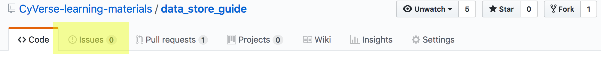

.. include:: cyverse_rst_defined_substitutions.txt

|CyVerse_logo|_

|Home_Icon|_
`Learning Center Home <http://learning.cyverse.org/>`_

**Creating Documentation in the CyVerse Learning Center**
==========================================================

..
    #### Comment: Use short, imperative titles e.g. Upload and share data, uploading and
    sharing data ####

Goal
----

All users are invited to contribute to CyVerse documentation, from fixing a typo
to contributing a new tutorial. This quickstart will get you through the initial
steps of your contribution.

----

.. toctree::
	:maxdepth: 2

	Quickstart home <self>
	Example ReStructured Text <example_directives_delete.rst>
..
	#### Comment:This tutorial can have multiple pages. The table of contents assumes
	you have an additional page called 'Step Two' with content located in 'step2.rst'
	Edit these titles and filenames as needed ####

..
    #### Comment: If you are using the TOC remove the 'summary', 'Additional information,
    help' and 'Fix or improve this tutorial' from all pages except the last page of the
    quickstart ####

-----

Prerequisites
-------------

Downloads, access, and services
~~~~~~~~~~~~~~~~~~~~~~~~~~~~~~~

*In order to complete this tutorial you will need access to the following services/software*

 .. list-table::
   :header-rows: 1

   * - Prerequisite
     - Preparation/Notes
     - Link/Download
   * - CyVerse account
     - You will need a CyVerse account to complete this exercise
     - |CyVerse User Portal|
   * - GitHub account
     - You will need a GitHub account to complete this exercise
     - |GitHub|
   * - A text editor
     - You will need a text editor (word processing programs like Microsoft
       Word introduce formatting errors and **are not acceptable**). We
       recommend a free editor like Atom
     - |Atom|

Platform(s)
~~~~~~~~~~~

*We will use the following platform(s):*

 ..
   #### comment: delete any row not needed in this table ####

.. list-table::
    :header-rows: 1

    * - Platform
      - Interface
      - Link
      - Platform Documentation
    * - CyVerse Learning Center
      - Github repository and ReadTheDocs
      - |CyVerse Learning Center|
      - This document
    * - GitHub
      - Online repository management
      - |GitHub|
      - |GitHub Guide|
    * - Read the Docs
      - Online documentation platform
      - |Read the Docs|
      - |Read the Docs Docs|

----

*A. Improving Existing Documentation in the CyVerse Learning Center*
---------------------------------------------------------------------

All CyVerse documentation is a community effort. You can contribute in several
ways including:

 - Reporting typos or grammatical mistakes
 - Identifying instructions that are out-of-date, unclear, or wrong
 - Suggesting other improvements

You can help fix these by reporting a documentation issue. You can click
the |Intercom| icon on the lower-left of your screen and send us a message. Or,
if you are familiar with GitHub you can either **file and issue** or **submit a
pull request.** Creating issues just requires a few seconds of your time, so
we will cover that here:

**Creating an issue on GitHub**

  1. At the bottom of the documentation there should be a link called
     |Github Repo Link| or Repo Link. Click this link to go to the GitHub
     Repository (the online location of the documentation text).

  2. On the GitHub site, click the "Issues" tab near the top of the screen.

     |issues|

     **If the issue list is empty**
     Click "New Issue"; You may need to login to your GitHub account. Give
     your issue a descriptive title and a comment. Once you are done,
     click "Submit new issue." You will receive notifications (unless you opt
     out) from GitHub on the status of your issue.

     **If the issue list is contains issues**
     If possible, check to see that the issue you identified is not in the
     current list. If your issue already exists, you may still wish to leave a
     comment. If you think your issue is new, click "New Issue"; you may need
     to login to your GitHub account. Give your issue a descriptive title and
     then leave a comment. Once you are done, click "Submit new issue." You will
     receive notifications (unless you opt out) from GitHub on the status of
     your issue.

----

*B. Creating New Documentation in the CyVerse Learning Center*
----------------------------------------------------------------

These instructions assume some familiarity with GitHub. If you are not
comfortable with GitHub, but have a documentation contribution to make, please
email us with your ideas or content: `Tutorials@CyVerse.org <Tutorials@CyVerse.org>`__.

   .. tip::

    Every documentation piece is create from a template in a GitHub repository.
    There are some template-specific instructions in the **README.md** file in
    each repository. This Quickstart will highlight the main steps, but please
    refer to that readme file.

  1. You will need to import a template repo into your own Github account. You
     can follow the |Github instructions for importing| a repo. The CyVerse
     template repos are:

       - |CyVerse Manual template|
       - |CyVerse Guide template|
       - |CyVerse Tutorial template|
       - |CyVerse Quickstart template|

  2. After importing the template, clone it to your local computer and develop
     the text of your tutorial. See the **README.md** file in your downloaded
     template for specific step-by-step instructions. CyVerse documentation is
     written in |ReStructured Text|, a plain text format very similar to
     Markdown. See the ReStructured Text examples on the next page.

  3. Once your materials are complete, please notify Tutorials@CyVerse.org that
     your tutorial is ready for inclusion in the main CyVerse documentation repo.
     We will review and verify the contribution, and add you as a maintainer repo
     in the CyVerse collection. If your documentation contains example data,
     we will also assist you in making sure that data is accessible to others
     who would use the documentation.

		 **Tutorial Creation Flowchart**

		 |draft_new_lc_docs|

   .. tip::

     You can use these templates and instructions to create your documentation
     without having it hosted on the CyVerse Learning Center. See the |Read the Docs Docs|.

----

Additional information, help
~~~~~~~~~~~~~~~~~~~~~~~~~~~~

..
    Short description and links to any reading materials

Post your question to the user forum:
|Ask CyVerse|

----

**Fix or improve this documentation**

- Search for an answer:
  |CyVerse Learning Center|
- Ask us for help:
  click |Intercom| on the lower right-hand side of the page
- Report an issue or submit a change:
  |Github Repo Link|
- Send feedback: `Tutorials@CyVerse.org <Tutorials@CyVerse.org>`_

----

|Home_Icon|_
`Learning Center Home <http://learning.cyverse.org/>`__

.. Comment: Place Images Below This Line
   use :width: to give a desired width for your image
   use :height: to give a desired height for your image
   replace the image name/location and URL if hyperlinked

 .. |Clickable hyperlinked image| image:: ./img/IMAGENAME.png
    :width: 500
    :height: 100
 .. _CyVerse logo: http://learning.cyverse.org/

 .. |Static image| image:: ./img/IMAGENAME.png
    :width: 25
    :height: 25

.. Comment: Place URLS Below This Line

   # Use this example to ensure that links open in new tabs, avoiding
   # forcing users to leave the document, and making it easy to update links
   # In a single place in this document

   .. |Substitution| raw:: html # Place this anywhere in the text you want a hyperlink

      <a href="REPLACE_THIS_WITH_URL" target="blank">Replace_with_text</a>

.. |Github Repo Link|  raw:: html

   <a href="https://github.com/CyVerse-learning-materials/documentation_quickstart" target="blank">Github Repo Link</a>

.. |GitHub| raw:: html

   <a href="https://github.com/" target="blank">GitHub</a>

.. |GitHub Guide| raw:: html

   <a href="https://guides.github.com/" target="blank">GitHub Guide</a>

.. |Read the Docs| raw:: html

   <a href="https://readthedocs.com/" target="blank">Read the Docs</a>

.. |Read the Docs Docs| raw:: html

   <a href="https://docs.readthedocs.io/en/latest/" target="blank">Read the Docs Docs</a>

.. |Atom| raw:: html

   <a href="https://atom.io/" target="blank">Atom</a>

.. |Github instructions for importing| raw:: html

   <a href="https://help.github.com/articles/importing-a-repository-with-github-importer/" target="blank">Github instructions for importing</a>

.. |CyVerse Manual template| raw:: html

   <a href="https://github.com/CyVerse-learning-materials/cyverse_manual_template.git" target="blank">CyVerse Manual template</a>

.. |CyVerse Guide template| raw:: html

   <a href="https://github.com/CyVerse-learning-materials/cyverse_guide_template.git" target="blank">CyVerse Guide template</a>

.. |CyVerse Tutorial template| raw:: html

   <a href="https://github.com/CyVerse-learning-materials/cyverse_tutorial_template.git" target="blank">CyVerse Tutorial template</a>

.. |CyVerse Quickstart template| raw:: html

   <a href="https://github.com/CyVerse-learning-materials/cyverse_quickstart_template.git" target="blank">CyVerse Quickstart template</a>

.. |ReStructured Text| raw:: html

   <a href="http://docutils.sourceforge.net/rst.html" target="blank">ReStructured Text</a>
